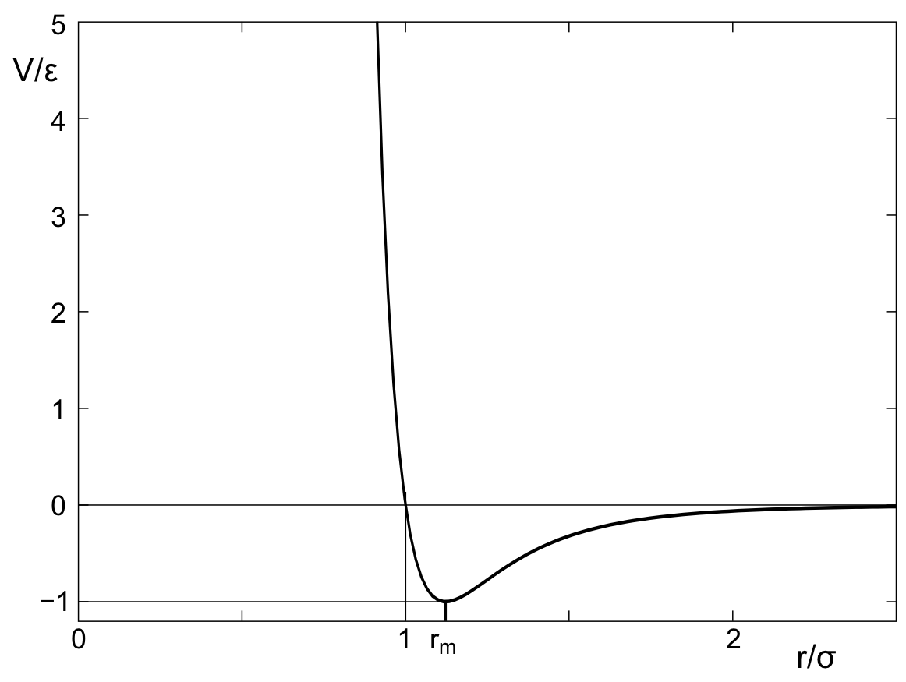
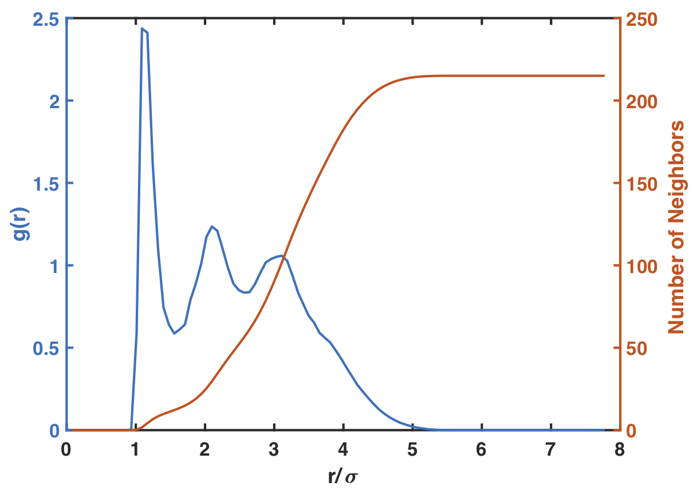
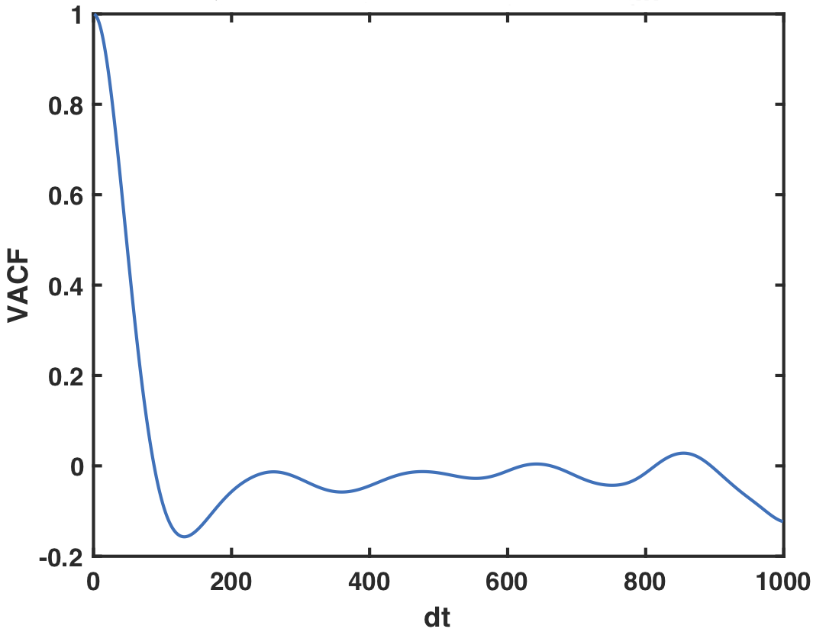

# Molecular Dynamics Simulation of a Lennard-Jones Fluid

In order to gain an understanding of molecular dynamics simulations, a sample system was generated. The goal of molecular dynamics simulations is to solve Newton's equations of motion for a system of particles, and after equilibrating, measure some observable quantity. The system of choice was a multidimensional fluid with a Lennard-Jones (LJ) interaction potential. The LJ potential was chosen due to available benchmark values and ease of simplified units. These dimensionless units are defined by choosing $\sigma$, $m$, and $\epsilon$ to be the units of length, mass, and energy, respectively, and making the following replacements for length, energy, and time:

In these units, the LJ potential is then defined as:

where *r* is the distance between atoms. The *r-12* term describes Pauli repulsion while the *r-6* term is due to dipole-dipole attraction. A plot of this potential is shown below.

Next, the velocity Verlet algorithm is introduced to integrate Newton's equations of motion. Starting with the two first-order differential equations of force,  and , the position function at time *t+dt* can be Taylor expanded:

Plugging in the original first-order differential equations: 

Expanding the original velocity function gives:

After expanding its derivative in the same fashion, plugging in and rearranging, the final equation becomes:

With this, the velocity Verlet method can be executed in the following three steps:

1: Calculate .

2: Derive the force  from the above LJ potential.

3: Calculate .

Once the position, velocity, and force of all particles can be calculated, so can the thermodynamic properties of interest. It is important to note that this velocity Verlet method is perfectly general, and any reasonable potential could be used to calculate the forces. As an example, the radial distribution function (RDF) as well as the velocity auto-correlation function of the system is shown below.

In figure above, the first peak of the RDF is indicative of the first coordination shell of the liquid and later shows no recurrent structure, as expected. It is important to note that after the first peak, the RDF fluctuates about 1 and then goes to zero due to the lack of a periodic boundary condition for the sake of an accurate nearest neighbor count. If the periodic boundary condition was preserved, it would fluctuate about 1 indefinitely. Similarly, the velocity auto-correlation function in figure \ref{fig:vacf} quickly goes to zero and fluctuates about that point, showing no correlation to its previous structure. Together, these show the system has no ``memory'' of its past self, and are indicative of accurate simulation.
